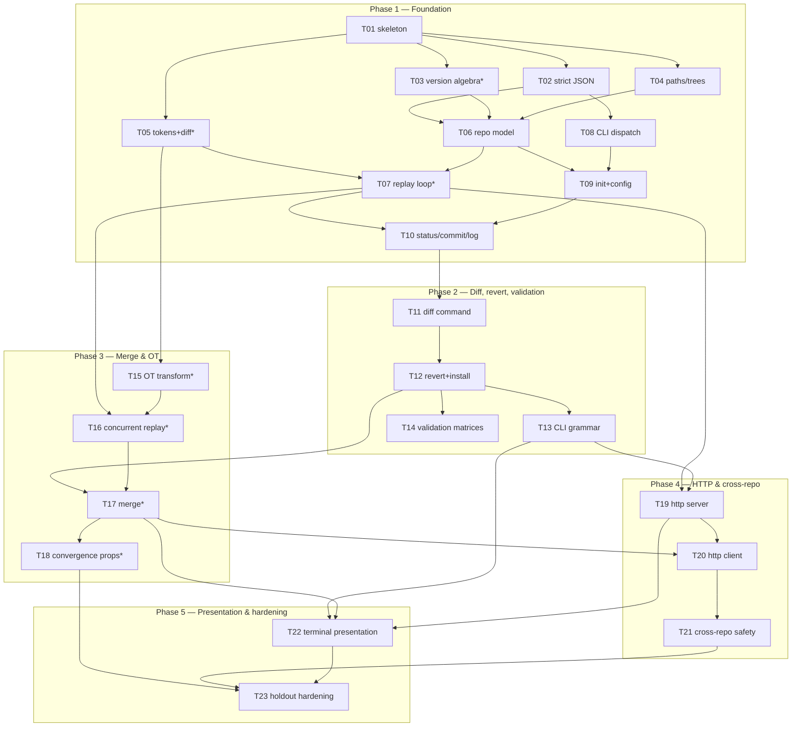

# PLAN — snap (Scala implementation)

> **Approval:** ✅ approved by the user 2026-09-04, including amendments `2bca0e6`
> (opinionated libraries) and `8c081c8` (Scala-first, jawn-parser) — see changelog.

Phases are vertical slices named by the provided tests they turn green. Task
**definitions** live in `tasks/T<nn>-*.md` (single source of truth), **status** lives in
`tasks/TASKS.md`, this file owns the **structure** (phases, dependencies, coverage).
Requirement ids (`R…`), design sections (DESIGN §), and locked decisions (`D…`) refer to
`docs/plan/SPEC-NOTES.md` and `docs/plan/DESIGN.md`.

## Verification

- Full suite: `./snap/verify --lang scala` (from repo root). Baseline recorded
  2026-09-04: command works, exits 1 — `snap/scala/` does not exist yet; 0/28 pass.
- Subset: `./snap/verify --lang scala --filter <substring>` (matches YAML filename or
  case name, e.g. `--filter 22-ot-matrix`). No step-level filter exists.
- Lint gate (every task commit and phase gate): `sbt scalafmtCheckAll` and
  `sbt "scalafixAll --check"` in `snap/scala/`.
- Phase gate: full suite + lint + `scala-antipatterns` skill + reviewer report per
  CLAUDE.md.

## Phases

| Phase | Name | Turns green | Tasks | SP |
|---|---|---|---|---|
| 1 | Foundation — init, config, status, commit, log | 01, 02, 03, 04, 08 | T01–T10 | 26 |
| 2 | Diff, revert & validation matrices | 05, 06, 07, 14, 15, 19, 23, 24, 25, 27 | T11–T14 | 10 |
| 3 | Merge & OT | 09, 10, 11, 17, 18, 21, 22 | T15–T18 | 13 |
| 4 | HTTP & cross-repo | 12, 13, 16, 20, 26 | T19–T21 | 7 |
| 5 | Terminal presentation & holdout hardening | 28 | T22–T23 | 5 |

Phase 1 is deliberately the largest: it contains the whole pure core (versions, diff,
JSON, replay skeleton) that every later phase reuses; phases 2–5 are thin slices over it.
After phase 5: post-completion audit (three independent reviewers) per CLAUDE.md.

## Task index

**Phase 1 — Foundation** (green: 01-init, 02-init-paths, 03-configuration,
04-commit-status-log, 08-unsupported-entries)

- [T01](../../tasks/T01-workspace-skeleton.md) — Scala workspace skeleton & lint gate · 2 SP · normal · deps: —
- [T02](../../tasks/T02-strict-json.md) — Strict JSON layer & canonical writer · 3 SP · normal · deps: T01 · ∥-safe with T03/T04/T05
- [T03](../../tasks/T03-version-algebra.md) — Version algebra (compare/join/snap order) · 3 SP · **core** · deps: T01 · ∥-safe
- [T04](../../tasks/T04-paths-trees.md) — Paths, Utf8Order, trees · 2 SP · normal · deps: T01 · ∥-safe
- [T05](../../tasks/T05-tokens-diff.md) — Text tokens, edit scripts, canonical diff · 3 SP · **core** · deps: T01 · ∥-safe
- [T06](../../tasks/T06-repository-model.md) — Repository model, codec, structural validation · 3 SP · normal · deps: T02, T03, T04
- [T07](../../tasks/T07-replay-loop.md) — Replay ready-loop, materialization, validation 5–6 · 3 SP · **core** · deps: T05, T06
- [T08](../../tasks/T08-cli-dispatch.md) — CLI dispatch, discovery, plain output, exit codes · 2 SP · normal · deps: T02
- [T09](../../tasks/T09-init-config.md) — `init` + `config` · 2 SP · normal · deps: T06, T08
- [T10](../../tasks/T10-status-commit-log.md) — Worktree scanner, `status`, `commit`, `log` · 3 SP · normal · deps: T07, T09

**Phase 2 — Diff, revert & validation matrices** (green: 05-diff-goldens,
06-binary-and-empty, 07-revert, 14-cli-errors, 15-repository-validation,
19-version-boundaries, 23-strict-validation-matrix, 24-cli-grammar-matrix,
25-config-version-path-boundaries, 27-history-canonicality)

- [T11](../../tasks/T11-diff-command.md) — `diff` command & rendering · 3 SP · normal · deps: T10
- [T12](../../tasks/T12-revert-install.md) — Filesystem install & `revert` · 2 SP · normal · deps: T11
- [T13](../../tasks/T13-cli-grammar.md) — CLI grammar matrix & port validation · 2 SP · normal · deps: T12 · ∥-safe with T14
- [T14](../../tasks/T14-validation-matrices.md) — Validation matrices & error catalog completion · 3 SP · normal · deps: T12 · ∥-safe with T13

**Phase 3 — Merge & OT** (green: 09-merge-text, 10-merge-conflicts,
11-namespace-conflicts, 17-concurrent-creates, 18-three-way-convergence,
21-version-algebra, 22-ot-matrix)

- [T15](../../tasks/T15-ot-transform.md) — OT transform · 3 SP · **core** · deps: T05 · ∥-safe (may run during phase 2)
- [T16](../../tasks/T16-concurrent-replay.md) — Concurrent replay: namespace, path rules, warnings · 5 SP · **core** · deps: T07, T15
- [T17](../../tasks/T17-merge-command.md) — `merge` command · 3 SP · **core** · deps: T12, T16
- [T18](../../tasks/T18-convergence-properties.md) — Convergence hardening & property suite · 2 SP · **core** · deps: T17

**Phase 4 — HTTP & cross-repo** (green: 12-http-server, 13-http-client,
16-dot-collision, 20-dirty-merge, 26-portability-and-failure-safety)

- [T19](../../tasks/T19-http-server.md) — `--serve` HTTP server · 3 SP · normal · deps: T07, T13
- [T20](../../tasks/T20-http-client.md) — HTTP client & remote operands · 2 SP · normal · deps: T17, T19
- [T21](../../tasks/T21-cross-repo-safety.md) — Cross-repo collision, failure precedence, portability · 2 SP · normal · deps: T20

**Phase 5 — Terminal presentation & holdout hardening** (green:
28-terminal-presentation)

- [T22](../../tasks/T22-terminal-presentation.md) — Terminal renderer, SNAP_COLOR/NO_COLOR, TTY · 3 SP · normal · deps: T13, T17, T19
- [T23](../../tasks/T23-holdout-hardening.md) — Holdout-gap hardening & final pass · 2 SP · normal · deps: T18, T21, T22

## Dependency graph

`*` = Risk: core (clock compare / merge / tie-break — formal pre-commit review).

## Test map

Every provided test belongs to exactly one phase (the one that turns it green):

| Test | Phase | Primary tasks |
|---|---|---|
| 01-init | 1 | T09 |
| 02-init-paths | 1 | T09 |
| 03-configuration | 1 | T09 |
| 04-commit-status-log | 1 | T10 |
| 08-unsupported-entries | 1 | T10 |
| 05-diff-goldens | 2 | T11 |
| 06-binary-and-empty | 2 | T11 |
| 07-revert | 2 | T12 |
| 14-cli-errors | 2 | T13 |
| 24-cli-grammar-matrix | 2 | T13 |
| 15-repository-validation | 2 | T14 |
| 19-version-boundaries | 2 | T14 |
| 23-strict-validation-matrix | 2 | T14 |
| 25-config-version-path-boundaries | 2 | T14 |
| 27-history-canonicality | 2 | T14 |
| 09-merge-text | 3 | T17 |
| 10-merge-conflicts | 3 | T17 |
| 11-namespace-conflicts | 3 | T17 |
| 17-concurrent-creates | 3 | T17 |
| 21-version-algebra | 3 | T17 |
| 18-three-way-convergence | 3 | T18 |
| 22-ot-matrix | 3 | T18 |
| 12-http-server | 4 | T19 |
| 13-http-client | 4 | T20 |
| 16-dot-collision | 4 | T21 |
| 20-dirty-merge | 4 | T21 |
| 26-portability-and-failure-safety | 4 | T21 |
| 28-terminal-presentation | 5 | T22 |

## Requirement map

Every requirement (SPEC-NOTES §1) is owned by at least one task:

| Requirements | Owner tasks |
|---|---|
| R1–R16 model & invariants | T03, T06, T07, T16, T17 |
| R17–R27 repository & working tree | T04, T09, T10, T12 |
| R28–R38 versions, snap order, serial rule | T03, T06, T17 |
| R39–R52 repository/patch format | T02, T06, T14 |
| R53–R58 tokens & edit scripts | T05 |
| R59–R60 validation | T06, T07, T14 |
| R61–R64 canonical diff | T05 |
| R65–R76 replay, OT, warnings, convergence | T07, T15, T16, T17, T18 |
| R77–R82 CLI basics, init, config | T08, T09, T13 |
| R83–R89 status/log/commit/diff/revert/merge | T10, T11, T12, T17 |
| R90–R91 serve & version | T19, T13 (port), T08 (`--version`) |
| R92–R97 presentation | T08 (plain), T22 (terminal) |
| R98–R100 configuration | T09 |
| R101–R102 HTTP | T19, T20 |
| R103–R107 mutation, failures, exit codes | T08, T12, T14, T21 |
| R108 TTY unit tests | T22 |
| R109 property tests | T18 |

Untested-by-suite requirements (SPEC-NOTES §2.1) are explicitly owned by T23 plus the
task that implements them (holdout assumption — implemented and unit-tested, not skipped).

## Risks & mitigations

| Risk (SPEC-NOTES §6) | Mitigation |
|---|---|
| Diff tie-break divergence silently corrupts merges | T05 implements the literal DP (D18); golden + property tests; core review |
| Replay pipeline rule-ordering errors (snap order direction, namespace-before-path-rules, aggregate Q, Q-insert priority, warning subtraction) | isolated in T07/T15/T16/T17 with per-rule unit tests + permutation property tests (T18); each is a core pre-commit review |
| Byte-stable surfaces (canonical JSON, diff rendering, log escaping, ANSI layouts) | one canonical serializer (D7); goldens lifted from the YAML tests; test 28 bytes in T22 |
| Strict JSON traps (duplicate keys, 2^53 from text) | jawn-parser with a custom Facade building our AST — duplicate detection, raw number text, and pinned messages are ours (D2, §6); test 23/25 matrices in T14 |
| JVM/harness realities (signals→exit 0, UTF-8 under LC_ALL=C, startup budget, HEAD bytes) | D20–D22 decided up front; T19/T22 acceptance criteria name them; thin Main (gotcha 9) |
| Phase 1 breadth delays first green tests | T02–T05 are parallel-safe (disjoint files); board tracks per-task status |

## Changelog

- 2026-09-04 — initial plan written (spec analysis: `SPEC-NOTES.md` same date); awaiting
  user approval.
- 2026-09-04 — D2 revised on user direction ("use opinionated libraries for known
  problems"): jackson-core adopted as the JSON tokenizer beneath our strict AST/
  validation/canonical writer (DESIGN §6); HTTP and CLI stay JDK/hand-rolled with
  rationale recorded in D2. T01/T02 acceptance criteria updated accordingly.
- 2026-09-04 — D2 refined on user direction ("prefer Scala libraries"): jackson-core →
  **jawn-parser** (Typelevel, Scala) — its custom-Facade design hands over raw number
  text and per-key callbacks natively, a strictly better fit. Scala-first recorded as
  the standing rule in D2, with the JDK-HTTP/hand-rolled-CLI exceptions justified.
- 2026-09-04 — user directive: **phases pipeline.** Later-phase tasks with satisfied
  dependencies may run in parallel with an earlier phase's review (phase 3's T15
  started alongside the phase-1 endgame; phase 2 starts right after T10). Review gates
  unchanged: each phase closes only after its findings are triaged and fixes committed.
  CLAUDE.md ground rule 6 and the task-loop phase boundary amended accordingly.
